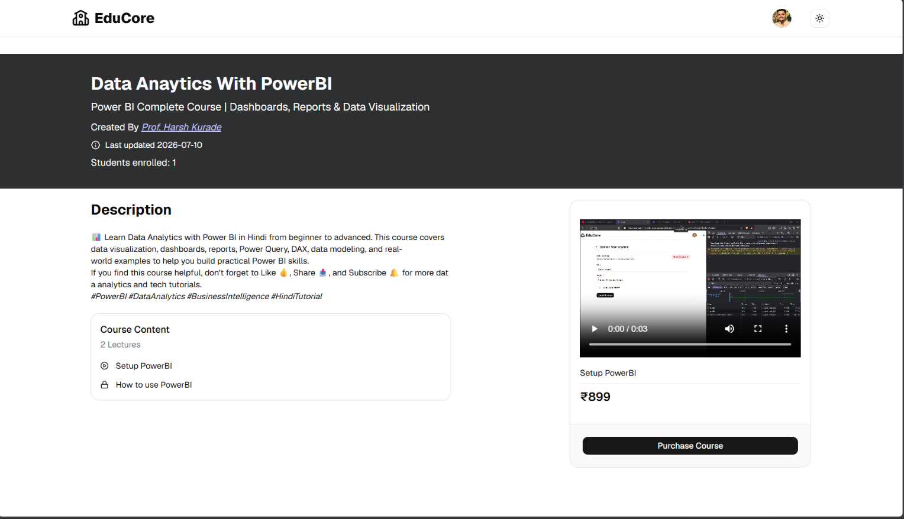

# EduCore

A full-stack Learning Management System (LMS) where instructors can create and publish courses with video lectures, and students can browse, purchase, and track their progress through courses.

🔗 **Live Demo:** [educore-nk4m.onrender.com](https://educore-nk4m.onrender.com)
_(hosted on a free server, so the first load may take up to a minute)_

## Features

**For Students**

- Sign up / log in securely (JWT authentication)
- Browse, search, and filter courses
- Purchase courses with Stripe
- Track progress lecture-by-lecture
- "My Learning" dashboard for enrolled courses
- Editable profile with photo upload

**For Instructors**

- Admin dashboard to manage courses
- Create/edit courses with rich text descriptions
- Upload video lectures and thumbnails
- Publish or unpublish courses
- Toggle free preview lectures

## Tech Stack

**Frontend:** React, Redux Toolkit, React Router, Tailwind CSS, shadcn/ui

**Backend:** Node.js, Express, MongoDB, Mongoose

**Other Tools:** JWT (authentication), Cloudinary (media storage), Stripe (payments)

**Deployment:** Render

## Demo Credentials

You can try the app directly without signing up, using either of these accounts:

| Role    | Email            | Password |
| ------- | ---------------- | -------- |
| Student | adarsh@gmail.com | Pass@123 |

**Note:** Payments run in Stripe **test mode** — no real money is charged. Use this test card at checkout:

```
Card number: 4242 4242 4242 4242
Expiry: any future date
CVC: any 3 digits
```

## Screenshots

### Homepage


### Admin Dashboard


### Checkout


### Course Details



## Getting Started

```bash
# Clone the repo
git clone https://github.com/sarthakz-47/EduCore.git
cd EduCore

# Install dependencies
npm install
npm install --prefix client

# Add environment variables (see below), then run:
npm run dev              # starts backend
cd client && npm run dev # starts frontend (in a new terminal)
```

**Environment variables** (create a `.env` file in the root folder):

```env
PORT=8080
MONGO_URI=your_mongodb_connection_string
SECRET_KEY=your_jwt_secret
CLOUD_NAME=your_cloudinary_cloud_name
API_KEY=your_cloudinary_api_key
API_SECRET=your_cloudinary_api_secret
STRIPE_SECRET_KEY=your_stripe_secret_key
WEBHOOK_ENDPOINT_SECRET=your_stripe_webhook_secret
```

## What I Learned

- Building a full-stack app with a React frontend and an Express/MongoDB backend
- Implementing secure authentication with JWT and httpOnly cookies
- Integrating third-party services: Stripe for payments, Cloudinary for media
- Deploying a full-stack app as a single service on Render
- Debugging real deployment issues — CORS, cross-origin cookies, and verifying Stripe webhook signatures correctly

## License

This project currently has no explicit license.
